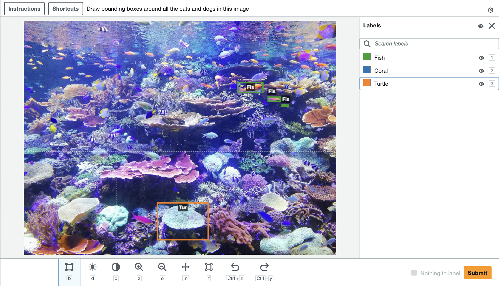

# Web Components Are Important

#### *Expanding the Foundation of the Web*

---

Web components are back on the hot seat. Ryan Carniato set the space on fire with his post [Web Components are Not the Future](https://dev.to/ryansolid/maybe-web-components-are-not-the-future-hfh), and the subsequent discussion has been spicy. I'm not going to counter or analyze the points he makes in that article, Nolan Lawson does that better than I could in his response, [Web Components Are Okay](https://nolanlawson.com/2024/09/28/web-components-are-okay/). Instead, I will expand upon Nolan's points in his excellent post, [Use Web Components For What They're Good At](https://nolanlawson.com/2023/08/23/use-web-components-for-what-theyre-good-at/) to show that Web Components are critical to the future of the web.
## Why Do I Need a Framework to Build a Web Page?

In 1996, I was 7 years old, and I built a Dragonball Z fan page in plain old HTML. I wrote it using Notepad in a single file. In high school and college, I built more interesting sites with CSS and jQuery, all in a simple folder. The web had evolved but still made intuitive sense to me. Then I graduated and got a job doing KnockoutJS and Angular, and it was as if I'd jumped from arithmetic to calculus. Node? NPM? Package versions? Bundlers? Compilers? I needed exponentially more knowledge than ever just to run the website.

Web Components offer developers the opportunity to develop for the web itself and extend HTML to bring new and complex functionality into tags that a 7-year-old could understand and use.
## Prove it

At Amazon, I helped create a collection of Web Components called [Crowd HTML Elements](https://blog.mturk.com/mturk-introduces-crowd-html-elements-a-library-of-easy-to-use-task-interfaces-for-bounding-box-35bb9c860069) to empower non-technical users to create complex annotation interfaces for machine learning training. [This](https://codepen.io/sagemaker_crowd_html_elements/pen/XWpJGad) is a Codepen of a full image annotation application built using Crowd HTML Elements. There is no JavaScript or CSS in the Codepen, just an HTML file which looks like this:

```html
<script src="https://assets.crowd.aws/crowd-html-elements.js"></script>

<crowd-form>
  <crowd-bounding-box
	name="annotatedResult"
    src="{{ImageUrl}}"
    header="Draw bounding boxes around all the cats and dogs in this image"
    labels="['Fish', 'Coral', 'Turtle']"
  >
    <full-instructions header="Bounding Box Instructions" >
      <p>Use the bounding box tool to draw boxes</p>
      <ol>
        <li>More instructions go here</li>
      </ol>
    </full-instructions>

    <short-instructions>
      Draw boxes around the requested target of interest.
    </short-instructions>
  </crowd-bounding-box>
</crowd-form>  
```
Which renders an entire application that looks like this:


The `<crowd-bounding-box>` component encapsulates the complexity of working with a `<canvas>` element and surfaces an application that is dead simple to configure for anyone. 

Components like this are also hackable with minimal coding knowledge. [This link](https://github.com/aws-samples/amazon-sagemaker-ground-truth-task-uis/blob/master/images/bounding-box-custom-labels.liquid.html) demonstrates how a user could enhance `<crowd-bounding-box>` to let end-users dynamically add and edit labels. This creation and hacking requires no node or NPM, bundlers, compilers, or transpilers, just a `<script>` tag. A similar modification to a React component is challenging in comparison.

Crowd HTML Elements has helped tens of thousands of users create hundreds of thousands of complex applications without needing extensive coding knowledge. For them, creating similar applications using a modern framework would be impossible.
## What Could the Future Look Like?

The previous "bounding box" example is quite basic compared to what is possible. Utilizing web components with carefully designed APIs allows us to develop self-assembling applications of limitless complexity that are easily extendable by anyone with an extra script tag. Let's take a moment to envision an online image editor built on web components using some ideal code.

```html
<script src="developer-A.com/open-app-layout.js"></script>
<script src="developer-B.com/image-editor-core.js"></script>
<script src="developer-C.com/image-toolset-painting.js"></script>
<script src="developer-D.com/image-toolset-hue-saturation.js"></script>
<script src="my-custom-gradient-tool.js"></script>

<open-app-layout left-drawer-open>
	<image-editor-core id="editor" slot="main" />
	<image-editor-tooldrawer slot="left-drawer">
		<painting-tools colors="[whatever you want]" />
		<hue-sat-tools />
		<my-custom-gradient-tool />
	<image-editor-tooldrawer>
</open-app-layout>
```

In this dream, a `<open-app-layout>` component provides a configurable, responsive layout. Slotted into the layout is a `<editor-core>` component that encapsulates a `<canvas>`, provides loading/saving functionality, and surfaces an interface for tools to connect. Finally, we have three chosen toolsets, `<painting-tools>` and `<hue-sat-tools>` from external developers, and `<my-custom-gradient-tool>,` which is something we have built ourselves to add functionality.

This hypothetical HTML file integrates components made by five developers, including ourselves, into a fully functional image editor. These components could have been built years apart using different frameworks or versions and work together seamlessly forever.
## Conclusion

Most developers think about web applications through the lens of compiled frameworks like React. Packages and components are imported, woven together, and then distributed as a complete application. There's little reason to bother with Web Components in this paradigm when framework native component libraries are available. This view is one-dimensional and ignores the most compelling aspects of Web Components. 

The internet is for everyone. It's ever-expanding, everlasting, and ever backward-compatible. It needs a specification so people who care can extend the foundational HTML it's built on. That specification is Web Components. For us developers, a wider HTML foundation means we can build complex applications more quickly using proven pre-fabricated pieces. For everyone else, building cool things on the web should be for more than just companies and developers; we need to lower that bar, or the internet may become a [lifeless husk](https://maggieappleton.com/ai-dark-forest).


